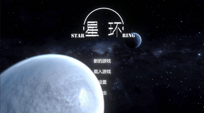
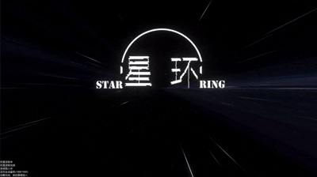
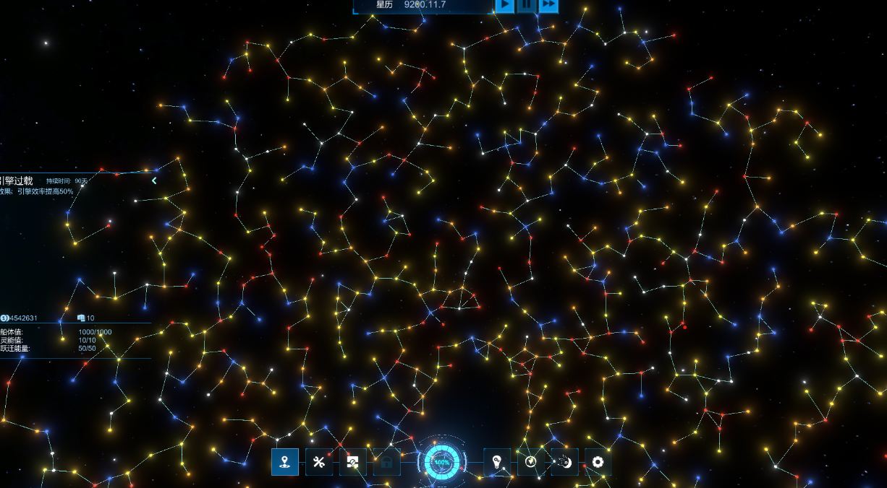
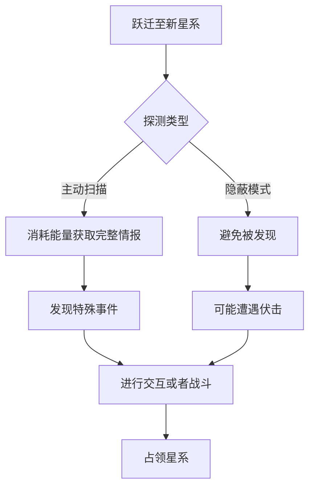
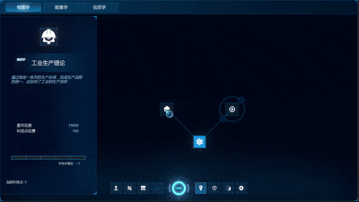
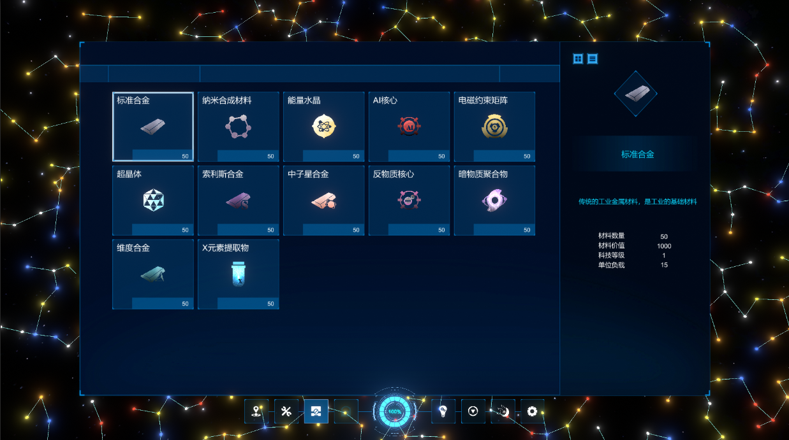
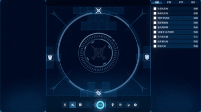

# Star-Ring-Demo - 科幻战舰RPG Demo 🚀⚔️



　　　　　　　　 *载入界面*　　　　　　　　　　　　　　　*游戏开始界面*


## 🔥 项目概述
《Star Ring》是基于Unity开发的科幻战舰策略RPG原型，玩家通过模块化装配系统打造独特星舰，在程序生成的宇宙中指挥舰队作战，并通过多线剧情决定星际文明的命运。

## ✨ 核心特色
- 🛸 **自由战舰设计** - 200+模块化部件自由组合，支持驱逐舰/巡洋舰/战列舰/泰坦级等12种舰型架构 
- ⚡ **科技研发** - 三维科技树系统，通过逆向工程解锁曲速核心/暗物质炮等尖端装备 
- 🌐 **沙盒宇宙** - 使用Prim算法随机生成的航道在超过1000+星系中自由探索
- 👥 **灵能释放** - 使用独特的灵能技能树操纵熵，时间，空间和心灵成为灵能大师
- ⚔️ **舰船战斗** - 战术指挥+护盾频率+灵能对抗系统，支持编队协同作战指令

## 🛠️ 系统架构

*主要星图界面*
### 1. 星图探索系统 🌟
在程序生成的1000+星系中展开探险，每个星域都包含独特的天文现象与文明遗迹：
```csharp
// 简化的星图生成算法（基于Prim最小生成树）
public void GenerateStarmap(int nodeCount) {
    List<StarNode> nodes = new();
    for(int i=0; i<nodeCount; i++){
        nodes.Add(new StarNode(Random.insideUnitSphere * 100f));
    }
    // 构建最小连接网络
    PrimAlgorithm.ConnectNodes(nodes); 
}
```
探索机制流程图：


### 2. 科研系统



超过100+科技等待研发，提供武器部件和舰队加成


### 3. 库存系统


收集物资，进行贸易，建立商业帝国

### 4. 装配系统(未完成)



自由组装舰船，配置武器

### 5. 战斗系统(未完成)

## 📜 开源协议


## 📬 联系我们
None
